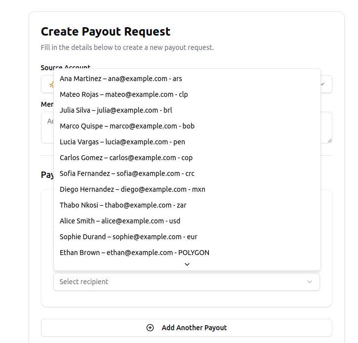

# Mural Pay – Coding Challenge Summary

This is a Single Page Application (SPA) built as part of the 2025 Mural Pay Coding Challenge. The application interacts with the Mural Pay Sandbox API to allow users to manage accounts and initiate payouts. It also integrates a public geolocation API to enhance the recipient selection experience.

## 🎯 Challenge Requirements Completed

All core requirements from the challenge brief were implemented:

1. ✅ **Customer & account creation** via API form  
2. ✅ **Payout request creation**, including fiat and blockchain methods  
3. ✅ **Payout execution** (note: a 500 error is returned by the API when sufficient funds are present—see notes below)  
4. ✅ **View payout request history and statuses** for a given account  
   > ℹ️ The payout search lists all payouts associated with the current bearer token, which maps to the currently active account. If the requirement referred to filtering payouts for an arbitrary account, that could be implemented as a future enhancement.  
5. ✅ **Public API integration**:  
   - IP-based geolocation (`ip-api.com`) used to order recipients by proximity in the payout form

## 💡 UX Enhancements

All enhancements below were implemented specifically on the **Create Payout Request** screen:

- **Smart recipient ordering**: Recipients are sorted by geographic distance to the user (based on IP geolocation), increasing the likelihood of selecting someone geographically closer. This behavior works correctly in local development, though it's currently not functioning in the deployed version for reasons under investigation.

<p align="center">
  
</p>

> Recipients are sorted by geographic proximity based on the user's IP. The distances are calculated from Montevideo (Uruguay) to each country’s main international airport (e.g., Ezeiza for Argentina, Guarulhos for Brazil). As shown, nearby countries appear first, which is the intended behavior.

- **Persistent "New" account badge**: The most recently created account is saved in local storage and marked with a 🆕 badge in the source account selector.
- **Main account pre-selection**: If the user has a main account, it is automatically pre-selected in the "Source Account" dropdown, reducing friction in frequent payout flows.

## ⚙️ Stack & Tooling

- **Framework**: React + TypeScript  
- **Forms**: React Hook Form + Zod  
- **UI**: Tailwind CSS + shadcn/ui  
- **State Management**: Zustand (with localStorage persistence)  
- **Data Fetching**: TanStack Query  
- **HTTP Client**: Ky  
- **Mocking Layer**: MSW (used early in development)  
- **Testing**: Cypress (E2E), Vitest (unit tests)

## 📁 Project Structure

The project follows a modular and role-based layout, grouping logic by responsibility (e.g., API, UI, state) instead of domain:

```
src/
├── api/          # External API clients and domain-level service methods
├── components/   # Shared UI components (shadcn/ui wrappers) and theme provider
├── hooks/        # React Query and business logic hooks
├── layouts/      # Page layout wrapper (BaseLayout)
├── lib/          # Utilities (toasts, geolocation, shared helpers)
├── pages/        # Route-based pages (account, payout, home)
├── stores/       # Global state store (single-purpose)
├── types/        # Core domain type declarations (account, payout)
```

Key patterns worth noting:

- **API separated into `clients` and `services`**, isolating low-level HTTP config from business concerns  
- **Hooks abstract side effects and server interactions**, keeping pages declarative  
- **Each route (e.g. `/account`, `/payout`) has its own page + co-located components**

## 🧠 Type Strategy

- Core domain models are located in `src/types`
- External API types are colocated with usage
- Mixed usage of `type` and `interface`:
  - Auto-generated interfaces from Mural API JSON examples
  - Manual types follow a consistent `type` convention

## 🧪 Testing

- ✅ **E2E (Cypress)**: Account creation flow  
- ✅ **Unit (Vitest)**: Geo-distance sorting logic  
- 🚫 Component-level testing was deprioritized due to time constraints

## 🧭 API Integration Notes

- **Execute Payout**:
  - Returns a `500 Internal Server Error` when the source account has sufficient balance.
  - Returns a proper “insufficient funds” error when balance is lacking.

- **Recipient Validation (ARS payouts)**:
  - If the `bankAccountNumber` doesn’t meet expected length, the API throws a 500 instead of a validation error.

- **Account propagation delay**:
  - As noted in Mural API documentation, account creation is **eventually consistent**. If a payout is requested immediately after creating an account, the API may return an error indicating that the account does not exist yet. A short delay is recommended between creation and first use.

- **Hardcoded Recipients**:
  - For time efficiency and to avoid building dynamic forms per payout type, a simplified list of recipients was hardcoded (1 per fiat country + 1 blockchain recipient). This ensures payouts are testable for all methods.
  - In a real-world scenario, recipients would be managed as user-owned contacts in the backend.

- **Missing Pagination in Search Payouts**:
  - Due to time constraints, the payout list is not paginated. The most recent payouts are shown at the top, and older entries may fall off the list.

## 🌐 Public APIs Used

- **IP-API** (`http://ip-api.com/json/`)  
  Used to detect the user's approximate location (via IP) and sort recipients by geographic proximity in the payout creation form.
  Used to detect the user's approximate location (via IP) and sort recipients by geographic proximity in the payout creation form.

  Used to detect the user's approximate location (via IP) and sort recipients by geographic proximity in the payout creation form.  

  > 💡 While it’s possible to access geolocation via the browser's built-in API, this requires user consent. If the user denies it, no location data would be available. Using an external IP-based API ensures fallback access and served as a good opportunity to integrate a public service in this context.

- **JSONPlaceholder**  
  Used temporarily during early development to simulate recipient data before API access was granted. Fully removed in the final implementation.

## ⏱ Time Allocation

Total development time: **~8 hours**, split as follows:

- ⏱ ~6 hours for core implementation:
  - Project setup (Vite + Tailwind + testing + shadcn/ui)  
  - Type definitions and form wiring  
  - Mural API integration (initially with mock API)  
  - Public API integration (IP-based geolocation)  
  - State management and UX polish  

- ⏱ ~2 hours for real API integration:
  - Adapting code due to differences between the documentation and actual API behavior  
  - Refactoring logic, payloads, and assumptions made during mocking phase  
  - Re-validating flows and error handling with the real backend

**Not included in this estimate:**

- Reading and understanding the API/docs  
- Designing the architecture and planning component responsibilities  
- Mocking API behavior with MSW during early development  
- Debugging unexpected API 500 errors  
- Final polish and README documentation  
- Fixing type errors in `PayoutRequestForm.tsx` (some were ignored for time efficiency)

## 🔐 Security Notice

As this is a frontend-only challenge, API keys are exposed in the client. In production, keys should be securely managed via a backend proxy.

## 🤖 Use of AI Tools

- **Cursor autocompletion (no agent)** was used deliberately to speed up boilerplate writing, while ensuring that all logic and structure were written and reasoned manually for evaluation purposes.  
- **V0** was used in the final stretch to scaffold the UI layout for the Create Payout Request screen, so I could quickly connect the logic I had already implemented.  
- **AI prompts** were used to support basic UI/UX decisions, especially in the absence of a Figma reference, helping evaluate general visual clarity and layout balance.  

Outside of the coding challenge context, I regularly use AI coding agents to accelerate development. For this project, I intentionally avoided agent-generated logic to ensure the submitted code reflects my own work and decisions. That said, I fully embrace productivity tooling in real-world environments.

## 🔮 Potential Improvements

If given more time, the following areas would be prioritized:

- Full pagination for the payouts table  
- Dynamic form rendering based on payout type  
- Component-level tests using Testing Library  
- Full CRUD emulation for contacts/recipients  
- Shared type normalization and schema extraction  
- UX enhancements (loading skeletons, better empty states, inline errors)
- Filtering payouts by `sourceAccountId` in the search table (to support listing payouts of a specific account explicitly)

## 📌 Known Technical Debt

- **PayoutRequestForm.tsx** was implemented under time constraints and has several improvement opportunities:
  - Extract Zod schemas to dedicated files  
  - Move internal logic (state, effects) to custom hooks  
  - Create helper utilities for defaults and value transformations  
  - Refactor into smaller components for maintainability

## 🔧 Environment Variables

To run the app with real API access, create a `.env` file in the project root with the following variables:

```env
VITE_MURAL_API_KEY=your_general_api_key_here
VITE_MURAL_TRANSFER_API_KEY=your_transfer_api_key_here
```

These are required to authenticate with the Mural Pay Sandbox API.

> ⚠️ In production, these keys should be stored securely and never exposed to the frontend.

## 🚀 Getting Started

```bash
pnpm install
pnpm dev
```

## 🧪 Running Tests

```bash
# Unit
pnpm test

# Cypress (E2E)
pnpm cy:open  # interactive
pnpm cy:run   # headless
```